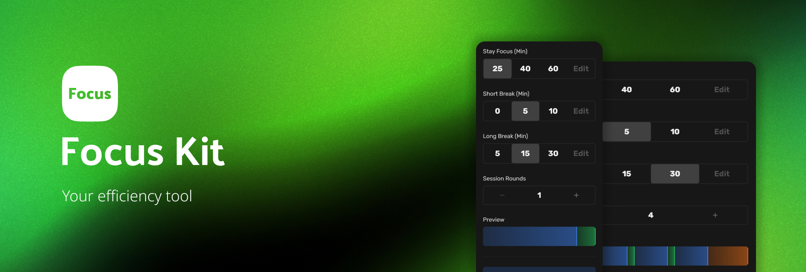

<p align="center">
  <a href="https://github.com/YuzeTT/focuskit">
    
  </a>
</p>

<h1 align="center">Focus Kit</h1>

<h3 align="center">Your efficiency tool.</h3>

<br>

<p align="center">
  <a href="https://github.com/YuzeTT/focuskit/blob/main/LICENSE">
    <image src="https://img.shields.io/github/license/YuzeTT/focuskit" alt="License" />
  </a>
  <!-- <a href="https://github.com/YuzeTT/focuskit/blob/main/package.json">
    <image src="https://img.shields.io/github/package-json/v/YuzeTT/focuskit" alt="License" />
  </a> -->
  <image src="https://img.shields.io/github/package-json/v/YuzeTT/focuskit" alt="License" />

  

</p>


## :sparkles: Features

- **Customizable** - You can customize the time to your liking

- **Portability** - Just open the web page and use it!

## 🛠 Building or running the app yourself

```bash
# install dependencies
$ pnpm install

# serve with hot reload at localhost:3000
$ pnpm dev

# generate the final static site
$ pnpm build
```
